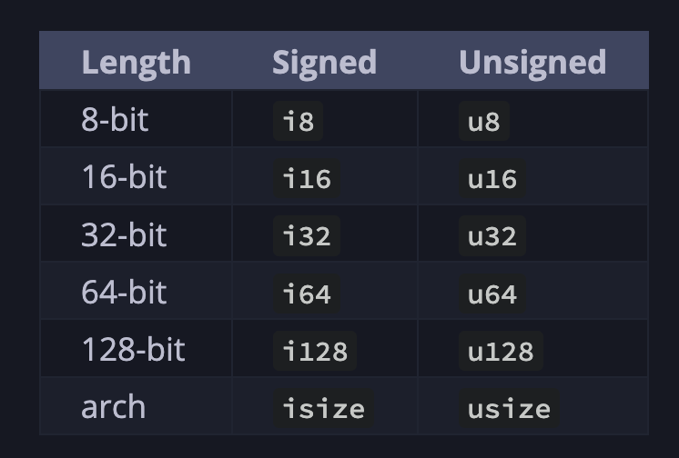
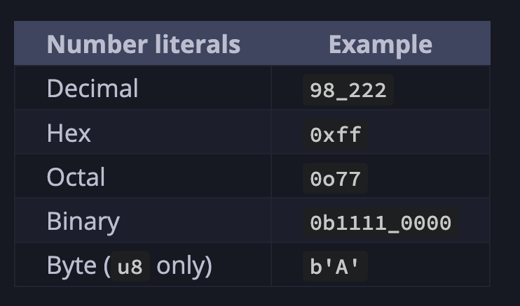

https://doc.rust-lang.org/book/

# 3.1 Variables and Mutability
By default, **variables are immutable.** When a variable is immutable, once a value is bound to a name, you can’t change that value. 

`cargo new variables`
`cargo run`

immutability error
`cannot assign twice to immutable variable `x``
```rust
fn main() {
    let x = 5;
    println!("The value of x is: {x}");
    x = 6;
    println!("The value of x is: {x}");
}
```

with `mut`
```rust
fn main() {
    let mut x = 5;
    println!("The value of x is: {x}");
    x = 6;
    println!("The value of x is: {x}");
}
```


`Constants` are values that are bound to a name and are not allowed to change, but there are a few differences between constants and variables.

Constants always **immutable** - cannot go with `mut`
Declare constants using the `const` keyword instead of the `let` keyword

Constants can be declared in any scope, including the global scope, which makes them useful for values that many parts of code need to know about.

The last difference is that constants may be set only to a constant expression, not the result of a value that could only be computed at runtime.

```rust
const THREE_HOURS_IN_SECONDS: u32 = 60 * 60 * 3;
```

`Constants` are valid for the entire time a program runs, within the scope in which they were declared.

## Shadowing
You can decalre a new variable with the same name as a previous variable. *The second variable* is what the compiler will see when you use the name of the variable. 
The second variable `overshadows`the first, taking any uses of the variable name to itself until itself is shadowed or the scope ends. 

We can shadow a variable by using the same variable's name and repeating the use of the `let` keyword as follows:

```rust
fn main() {
    let x = 5;
    let x = x + 1; // 6

    {
        let x = x * 2;
        println!("the value is: {x}"); // 12
    }

    println!("the value is: {x}"); //6
}
```

- Different from making a variable as `mut` vs. Shadowing

1. Avoid compile error
    - By using `let`, we can perform a few transformations on a value but have the variable be immutacle after those transformations have been completed.
2. Reuse name
    ```rust
    let spaces = "     ";
    let spaces = spaces.len();

    let mut spaces = "    ";
    spaces = spaces.len(); // compile error
    ```

# 3.2 Data Types
Every value in Rust is of a certain `data type`: `scalar` and `compound`, which tells Rust what kind of data is being specified so it knows how to work with that data.

Rust is a `statically typed` language: it must know the types of all variables at compile time

```rust
let guess: u32 = "42".parse().expect("Not a number");
```

If we don't use `:32` type annotation, rust will display the error: compiler needs more information from us to know whcih type we want to use:

```
compiling no_type_annotations....
error[E0284]: type annotation needed
```

## Scalar Type
A `scalar type` represents a single value

- **integers**: `u32` type
        - a number without a fractional component
        - 
        - signed numbers are stored using two's compelmenet representation (-(2^(n - 1)) to 2^(n - 1) - 1 inclusive)
        - 

- **floating-point numbers**: `f32`, `f64`
        - default type is `f64` because on the modern CPUs, it's roughly the same speed as `f32`

- **Booleans**: `true`, `false`
- **characters**: `char`

## Compound Type
A `compound type` can group multiple values into one type

- **Tuple**
    - once declared, cannot grow or shrink in size
    ```rust
    let tup: {i32, f64, u8} = (500, 6.4, 1);
    let (x, y, z) = tup;
    println!("y is {y}");
    ```

    ```rust
    fn main() {
    let x: (i32, f64, u8) = (500, 6.4, 1);

    let five_hundred = x.0;

    let six_point_four = x.1;

    let one = x.2;
    }
    ```
- **Array**
Every element in `array` must have the same value. Fixed length

```rust
let a = [1,2,3,4,5];
let a: [i32; 5] = [1, 2, 3, 4, 5];

let first = a[0];
let second = a[1];
```

Arrays are useful when you want to your data allocated on the stack, rather than the heap

# 3.3 Functions
Use `snake case`

```rust
fn main() {
    println!("Hello");
    another_function(5);
}

fn another_function(x: i32) {
    println!("The value of x is: {x}");
}
```

```rust
fn main() {
    print_labeled_measurement(5, 'h');
}

fn print_labeled_measurement(value: i32, unit_label: char) {
    println!("The measurement is: {value}{unit_label}");
}
```

## Statements and Expressions
- `Statements` are instructions that perform some action and do not return a value.
- `Expressions` evaluate to a resultant value. Let’s look at some examples.

# 3.5 Control Flow
## `if` Expressions
```rust
fn main() {
    let number = 3;

    if number < 5 {
        println!("condition was true");
    } else {
        println!("condition was false");
    }
}
```

```rust
fn main() {
    let condition = true;
    let number = if condition { 5 } else { 6 };

    println!("The value of number is: {number}");
}
```

## Repeating Code with loop
```rust
fn main() {
    loop {
        println!("again!");
    }
}
```

```rust
fn main() {
    let mut counter = 0;

    let result = loop {
        counter += 1;

        if counter == 10 {
            break counter * 2;
        }
    };

    println!("The result is {result}");
}
```

```rust
n main() {
    let a = [10, 20, 30, 40, 50];

    for element in a {
        println!("the value is: {element}");
    }
}
```

```rust
fn main() {
    for number in (1..4).rev() {
        println!("{number}!");
    }
    println!("LIFTOFF!!!");
}
```