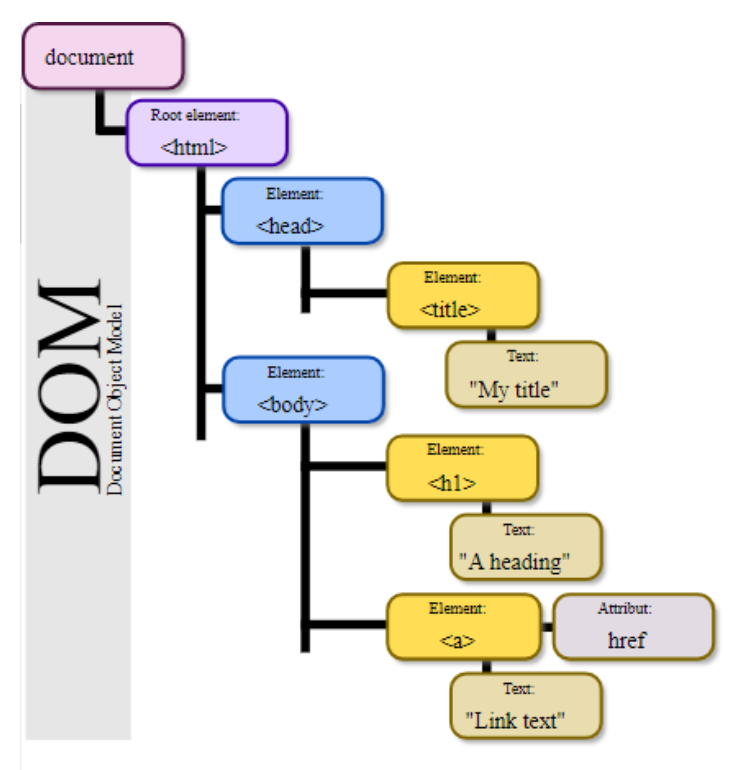

# Outline
• A question on application design
• OOP review
• Chrome debugging/developer tool
• Coding style rules in this class for this week’s lab onward
• HTML review
• CSS review
• JavaScript review
• Hosting tips

# Why web dev is so challenging?
### Web app vs Java Desktop App
- User can close the page unannounced 
    - The OS signals the java app before closure
- User can use any browser
    - windows, mac, linux
- User has limited resources (memory, cpu power, GPU power)
    - java app has entire resources at hand
- User can use any device (phone, tablet, desktop)
    - just a desktop computer or thin client
- Inf. frameworks and teechnologies
    - java and maybe java fx
- Security (anyone around the world can access your app)
    - only for you, no one else has access to your computer
- DoF service attatch, injection
    - no one else has access to your computer
- Server might go down, network goes down
    - your pc
- Remote
    - right in front of you


### Example
What factors would you consider?
A:
• Security
• Amount of Memory that could be available to the app
• Multitasking
• CPU speed
• GPU speed
• Taking adv of the device Sensors (GEO, Vibration, Camer)

# OOP in modern JS
### Inheritance 
Create a general vehicle class in JavaScript called vehicle and then extend it to create a specific type of vehicle, a car. This shows the "is-a" relationship where a car "is a" type of vehicle. 

```javascript
class Vehicle {
    constructor(brand) {
        this.brand = brand;
    }

    start() {
        console.log("starting the vehicle...");
    }
}

class Car extends Vehicle {
    constructor(brand, engineType) {
        super(brand);
        this.engineType = engineType;

        displayDetails() {
            console.log(`This is a ${this.brand} car with a ${this.engineType} engine`);
        }
    }
}

let myCar = new Car('BCIT', 'BCIT Engine');
myCar.start();
myCar.displayDetails();
```

### Composition
Create separate classes for Car and Engine, and then compose a car with an engine. This shows the "has-a" relationship
where a car "has an" engine.

```javascript
class Engine {
    constructor(type) {
        this.type = type;
    }

    start() { 
        console.log(`Starting ${this.type} engine...`); 
    }
}

class Car {
    constructor(brand, engineType) {
        this.brand = brand;
        this.engineType = engineType;
    }

    start() {
        this.engine.start();
        console.log(`${this.brand} card is running`);
    }
}

let myEngine = new Engine('V1');
let myCar = new Car('BCIT', myEngine);
myCar.start()
```

#### Inheritance vs Composition
- Inheritance
    - `is-a` type of Vehicle
    - inheriting its properties and methods
- Composition
    - car `has an` engine as a component
    - more flexibility
- **Composition over inheritance**: the flexibility

### Chrome Developper Tool

### Coding Style for this Lab Onward
- Variable declaration:
    - `const` first and `let` for variable declarations to ensure block-level scoping, with `const` being the default choice for variables that don't change. NEVER USE `var`
    - if a variable is not meant to be global, it should not be declared as such

- Object-Oriented Practices:
    - use classes and constructor functions to encapsulate and manage related data and behaviours

- Function length:
    - a function focuses on a single task
    - avoid side effects
    - has to be short
    - rule of thumb: function should fit on a screen without scrolling

- String and user message management:
    - store user-facing strings in separate files (JS or JSON) for easy management and localization 
        ex: error messages and UI lables
    - no hard coded user facing string messages
    - implementing a centralized message displaying mechanism

# HTML review 

### HTML Basics
- HTML is used to form components(element) of a web page
- Must start with a `<!DOCTYPE html>`
- HTML document itself begins with `<html>` and ends with `</html>`
- HTML - hyper text markup language
- Consists of tags `<b> BOLD </b>`
- An HTML script is consist of HTML elements
    - element ex: `<p> Hello World </p>`
- Tags generally *open* and *close* - except for single-element tags like ``, `<br>`, `<hr>`
- HTML elements are the building blocks of HTML pages
- HTML tags label peices of content such as `paragraph`, `image` and so on

### HTML elements and thier attributes
- Link
    - `<a href="link"> this lis a link </a>`
    - link destination is specified in the `href` attribute
    - attributes are used to provide additional information about HTML elements 

- Image
    - ``
    - source file, alternative text, width and height provided as **(pair:value) attributes**

#### What if we invent a new HTML tag?
- browserse do not display the HTML tags themselves, but use them to render the content between or inside them on the page

- browser ignores the new tag if no css/javascript/web component

- Everything is inside a tag : 
    
    In HTML, content is typically enclosed within HTML tags. Tags define the structure and purpose of the content.

- What happens if some text is NOT inside tag: 
    
    This refers to content that appears outside of any defined HTML tags. ->  plain content on the page

### HTML vs CSS vs JavaScript vs DOM
- **How** elements are logically attached to each other is determined by a tree graph called `DOM`
- **Where** every element is place and how it looks: `CSS`
- `JavaScript` is used to add *interactvely* to elements of a webpage, engage with users by handling events and how to add a new element to the page *dynamically*

### HTML Document Object Model (DOM)
- tree-like structure of DOM model: nested tags.


# Internet Technical Terms
### HTTP Hypertext Transfer Protocol
- The transfer protocol is the set of rules that the computers use to move files from one computer to another on the Internet
    - ex: HTTP
- `HTTPS` Hypertext Transfer Protocol Secure
    - uses separate protocols called `SSL`
- Two other protocols 
    - File Transfer Protocol(`FTP`)
    - Telnet Protocol(`TP`)


### Uniform Resource Locators
- The IP address and the domain name each identify a particular computer on the Internet
    - they do not indicate where a Web Page's HTML document resides on the computer
    - to identify a Web pages exact location, web browsers rely on **Uniform Resource Locator**: `URL`
- `URL` is a four-part addressing scheme that tells the Web browser:
    - what transfer protocol to use for transporting the file
    - the domain name of computer on which file resides
    - the pathname of the foler or directory on the computer on which file resides
    - the name of the file

### Structure of URL
- Uniform Resource Locators
- `http` : internet application protocol
- `://www.`: sub domain
- others: Top Level Domain (`TLD`)

### Tips
- dont forget the end tag
- sinle tags are referred as empty tags as there is nothing between opn and close tags
- HTML ags are not case sensitive `<p>` = `<P>`

### HTML Lists
- `<ul>` : unordered/bullet
- `<ol>` : ordered/numbered list
- `<li>` : each element

```html
<H2> An Unordered/Bullet </H2>
<ul> 
    <li> Bullet1
    <li> Bullet2
    <li> Bullet3
</ul>

<H2> An Ordered/Numbered </H2>
<ul>
    <li> Num1
    <li> Num2
    <li> Num3
</ul>
```

# HTML Input Elements
### Input Buttons

two attributes: `type=button` `value=try it`
```html
<input type="button" value="Try it"> 
```

button linked to the media
```html
<a href="https://media.giphy.com/media/Wsx8SB3gOyWZ2/giphy.gif" target="_blank">
  <input type="button" value="Click me">
</a>
```

### Radio Buttons
```html
<input type="radio" name="color" value="red"> Red <br>
<input type="radio" name="color" value="green"> Green <br>
<input type="radio" name="color" value="blue"> Blue <br>
```

### Text Formatting Elements
• `<b>` - Bold text

<b> Bold </b>

• `<strong>` - Important text

<strong> Strong </strong>

• `<i>` - Italic text

<i> italic </i>

• `<em>` - Emphasized text

<em> Emphasized </em>

• `<mark>` - Marked text

<mark> marked </mark>

• `<small>` - Small text

• `<del>` - Deleted text

• `<ins>` - Inserted text

• `<sub>` - Subscript text

• `<sup>` - Superscript text

### `<b>` vs `<strong>`
- both looks just the same however
    - the html `<b>` element defines bold text, without any extra importance
        - Since `<b>` is purely for presentation, it doesn’t provide any semantic value to search engines.
    - `<strong>` adds semantic "strong" importance
        - Screen readers recognize the `<strong>` element as having additional importance and may emphasize it with a change in tone or verbal emphasis, helping visually impaired users understand the content's significance.
        - Search engines consider `<strong>` text to be semantically important, which may improve its relevance in search indexing.
        - Example: Using `<strong>` around key phrases can signal their importance to search engines, potentially improving keyword recognition.

### `<i>` vs `<em>`
- both looks just the same however
- The HTML `<i>` element defines italic text, without any extra importance.
However `<em>` added semantic importance.


### Quotation and Citation Semantic Elements
- `<abbr>`: defines an abbreviation or acronym
    - <p>The <abbr title="World Health Organization">WHO</abbr> recently released new guidelines on public health.</p>
    ```html
    <p>The <abbr title="World Health Organization">WHO</abbr> recently released new guidelines on public health.</p> ```
    
- `<address>`: defines contact information for the author/owner of a document
    
    ```html
    <address>
    Contact us at: <a href="mailto:support@example.com">support@example.com</a><br>
    123 Main Street, Springfield, USA
    </address> 
    ```

- `<bdo>`: defines the text direction

    ```html
    <p><bdo dir="rtl">مرحبا بالعالم</bdo> translates to "Hello World" in Arabic.</p>
    ```

- `<blockquote>`: defines a section that is quoted from another source

    <blockquote cite="https://example.com/inspiring-quotes">
    "The only way to do great work is to love what you do."
    </blockquote>


    ```html
    <blockquote cite="https://example.com/inspiring-quotes">
    "The only way to do great work is to love what you do."
    </blockquote>
    ```
- `<cite>`: defines the title of a work

    <p>I recommend reading <cite>To Kill a Mockingbird</cite> by Harper Lee.</p>

    ```html
    <p>I recommend reading <cite>To Kill a Mockingbird</cite> by Harper Lee.</p>
    ```
- `<q>`: defines a short inline quotation 
    <p>As Albert Einstein once said, <q>Imagination is more important than knowledge.</q></p>

    ```html
    <p>As Albert Einstein once said, <q>Imagination is more important than knowledge.</q></p>
    ```

# HTML Styles with Style Attribute
- Setting The HTML style attribute follows the same syntax as other attributes
However there are two differences:

    - style is a global attribute = default attribute of all elements 
        - opposite: `src` only the attribute of few elements such as img and video

    - the value of the style attribute is an object with various property-value paris
        - 
        ```html 
        <tagname style="property:value;">
        ```

### Background Color
```html
<body style="background-color:powderblue;">
    </body>
```

### Text Color, Font Type
```html
<h1 style="color:blue;"> heading </h1>
<h1 style="font-family:verdana"> heading </h1>

<h1 style="color:blue; font-family:verdana;"> heading</h1>
```

### Specifying Colors in HTML
1. using a predefined color names such as orange, tomato, dogerblue, gray...

2. RGB, HEX, HSL, RGBA, HSLA values


### Font Size, Text Alignment
```html
<h1 style="font-size:300%; text-align:center;"> center, left, right, justify </h1>
```

### Border Color
```html
<h1 style="border:2px solid DodgerBlue;"> border colour</h1>
```

<p style="border:2px solid DodgerBlue;"> border colour</p>

Q. style a group of elements?
A. Use CSS Classes to apply the same style to multiple elements.
Use CSS Selectors to target specific types of elements.
```html
<!-- CSS Classes -->
<style>
  .group-style {
    color: blue;
    font-weight: bold;
  }
</style>
<p class="group-style">This is styled text.</p>
<h1 class="group-style">This is also styled.</h1>
<div class="group-style">This is part of the group.</div>
```

```html
<!-- CSS Selectors -->
<style>
  p {
    color: green;
    font-style: italic;
  }
</style>
<p>This is a paragraph.</p>
<p>This is another paragraph.</p>
```

Q. style a all the hyperlinekd texts?
To style all the hyperlinks on the page, you can use the `<a>` tag selector in CSS.

```html
<!-- Styling all links -->
<style>
  a {
    color: red;
    text-decoration: none;
  }
</style>
<a href="https://example.com">This is a link.</a>
<a href="https://another.com">This is another link.</a>
```

CSS provides pseudo-classes to style links based on their state:

a:link — Unvisited links.
a:visited — Links that have been visited.
a:hover — Links when hovered over.
a:active — Links when clicked.

```html
<style>
  a:link {
    color: blue;
  }
  a:visited {
    color: purple;
  }
  a:hover {
    color: orange;
    text-decoration: underline;
  }
  a:active {
    color: red;
  }
</style>
<a href="https://example.com">Hover or click me to see the effect!</a>
```

### 3 ways of styling HTML elements
1. Style attribute = inline styling
2. `<style>` tags in the `<head>` = internal styling
3. external CSS file (cascading style sheets)= external styling

# More HTML elements

### The Table Element `<table>`
- `<table>`: contains the table
- `<tr>`: table data cell
- `<th>`: table header cell (column)

### HTML `<div>` Tag
- Creates a section in an HTML document
<div style="background-color:lightgreen">
<h3>This is a heading</h3>
<p>This is a nice short paragraph.</p>
</div>

```html
<div style="background-color:lightgreen">
    <h3>This is a heading</h3>
    <p>This is a nice short paragraph.</p>
</div>
```

# Global Attributes: id, class

- `id`: its value has to be unique
- `class`: doesn't have to be unique

# CSS
### Selectors in CSS
- CSS is used to define styles, design, layout and variations in display for different devices and screen sizes.
-`selector` points to the HTML element you want to style (h1, p ...)
- name : value
- always ends with semicolon, and declaration blocks are surrounded by curly braces
```css
h1 {
    color: red;
    font-size: 12pc;
}
```

### CSS Selectors to select a group of element for styling
### Element selector
- select elements based on the element name
```html
<style>
    p {
        color: blue;
    }
</style>

<body>
    <p> selected element</p>
</body>
```

### ID Selector
- use id attribute of an HTML element to select a specific element

```html
<style>
    #firstID {
        color: blue;
    }
</style>

<body>
    <p id="firstID"> selected element </p>
    <p> nope </p>
</body>
```

### Class Selector
- selects elements with a specific class attribute
```html
<style>
    .firstClass {
        color: blue;
    }
</style>

<body>
    <p class="firstClass"> selected element</p>
</body>
```


### Mix and Match Selectors

<style>
    p.myClass {
        color: blue;
    }
    .italiccc {
        font-style: italic;
    }
</style>

<body>
    <h5 class="myClass"> not selected </h5>
    <h10 class="italiccc"> tilted </h10>
    <p class="myClass italiccc"> selected element</p>
</body>

```html
<style>
    p.myClass {
        color: blue;
    }
    .italiccc {
        font-style: italic;
    }
</style>

<body>
    <h5 class="myClass"> not selected </h5>
    <h10 class="italiccc"> tilted </h10>
    <p class="myClass italiccc"> selected element</p>
</body>
```

### Grouping Selectors
```html
<style>
    h1,
    h2,
    h5 {
        color: blue;
    }
</style>
```

### External Style Sheet
```html
<head>
    <link rel="stylesheet" type="text/css" href="myStyle.css" />
</head>
```

### The CSS Box Model
- all HTML elements can be considered as boxes
- **Box Model** term is used when talking about design and layout
- A box that wraps around HTML element
    - `Content`: the content of the box, where text and images appear
    - `Padding`: clears an area around the content. the padding is pransparent
    - `Border`: goes around the padding and content
    - `Margin`: clears an area outside the border. margin is transparent
    - margin -> border -> padding -> content

### CSS Layout, Display Property
- every HTML element has a default display value depending on what type of element it is. the default display value for most ewlements is `block`, `inline`, `none`

- `Block`
    - block-level element always starts on a new line and takes up the full width available 
    - default display value of the following elements is block
        - div, h1 ~ h6, p, form, header, footer, section

        ```html
        <div>This is a block element</div>
        <p>This is another block element</p>
        <h1>This is a heading</h1>
        ```

- `Inline`
    - does not start on a new line and only takes up as much width as necessary
    - inline by default
        - a, img, span
        ```html
        <span>This is an inline element</span>
        <a href="#">This is a link</a>
        
        ```

- `None`
    - `display:none`is used to remove elements from screen withotu deleting them

### CSS Layout, Visibility Property
`visibility:hidden` or `visibility:show`

- `visibility:hidden` elements will still take up the same space as before
- `visibility:none , hidden` : elements will not be removed from DOM tree

### Position Property of Style Attribute
- it specifies the type of positioning method used for an element
    - static(default), relative, absolute, fixed, sticky

### CSS Combinators
- descendant selector
- child selector (>)
    ```html
    <div class="parent">
    <p>Direct child</p>
    <div>
        <p>Not a direct child</p>
    </div>
    </div>

    <style>
        /* child selector */
        .parent > p {
        color: red; /* Applies to direct child <p> only */
        }
    </style>
    ```
- adjacent sibling selector (+)
    ```html
    <h1>Heading 1</h1>
    <p>Paragraph 1 (Adjacent to h1)</p>
    <p>Paragraph 2 (Not adjacent to h1)</p>

    <style>
    h1 + p {
        color: blue; /* Applies only to the first <p> after <h1> */
    }
    </style>
    ```
- general sibling selector (~)
    ```html
    <h1>Heading 1</h1>
    <p>Paragraph 1</p>
    <p>Paragraph 2</p>
    <div>Div 1</div>

    <style>
    h1 ~ p {
        color: green; /* Applies to all <p> siblings after <h1> */
    }
    </style>
    ```

- in general
    ```css
    /* selets all p in div */
    div p {
        background-color: yellow;
    }
    ```
### CSS Specificity
If there are two or more conflicting CSS rules that point to the same element, the browser follows some rules to determine which one is most specific and therefore wins out

1. Specificity Calculation
    - Inline styles: Specificity = 1000 (e.g., style="...").
    - ID selectors: Specificity = 100.
    - Class, attribute selectors, and pseudo-classes: Specificity = 10.
    - Type selectors: Specificity = 1.

2. Order Matters
    - If specificity is the same, the rule defined later in the stylesheet takes precedence.

### CSS Units
- absolute length units are not recommended for use on screen
    - `cm` for printer devices
    - `px` pixel: fixed-sized units 
    - `pt` points: fixed-sized units cannot scale in size
- **relative lengths**
    - `em` relative to the font-size of element 
    - `%` to parent element

# JavaScript
- **JavaScript** is used to add interactivity to elements of a webpage, engage with users by handling events and how to add a new element to the page dynamically
- JavaScript lruns in the browser
    ```html
    <body>
        <script>
            document.write("Hello");
            console.log("you know console");
            window.alert("popup message");

        </script>
    </body>
    ```
    - cannot delete files (JavaScript code to delete a file from your local hand-drive or server hard-drive)
    - `window.alert` is not recommended due to bad user experience

### Modifying HTML contents of an element
displays 11 not the conetnet of p
```html
<body>
    <p id="demo"> result will appear here</p>

    <script>
        document.getElementById("demo").innerHTML = 5 + 6;
    </script>
</body>
```


### Variables in JavaSript
- start with a letter, underscore or dollar sign 
- Variables are mutable, except `const`
    ```javascript
    const z = 5;
    console.log(z); // 5

    // z = 10; // Error: Assignment to constant variable

    // Example with a mutable data type
    const obj = { name: "John" };
    obj.name = "Doe"; // The object's property can be mutated
    console.log(obj); // { name: "Doe" }

    // But reassigning the object is not allowed
    // obj = { name: "Alice" }; // Error: Assignment to constant variable
    ```

    Q: which one issues an error message?
    - Declaring a constant object and modifying it -> error
        ```javascript
            const obj = { name: "John" };
            obj.name = "Doe"; // Modifies the property
            console.log(obj); // { name: "Doe" }

            // obj = { age: 30 }; // Error: Assignment to constant variable
        ```
    - Declaring a constant primitive variable and then modifying it -> no error
         ```javascript
            const num = 10;
            // num = 20; // Error: Assignment to constant variable
            console.log(num); // 10
        ```
- `let`: block-scoped, no re-declaration 
- `var`: function-scoped
- `const`: block-scoped, only primitive variables
```javascript
{
    var a = 10;
    let b = 10;
    const c = 10;

}
console.log(a); //10
console.log(b); //uncauchgt reference error - b is not defined
console.log(c); //uncaught reference error - c is not defined

```

### Variable Hoisting in JavaScript
- only for variables declard by `var`
- declarations are moved to the top of their containing scope during the complication phase, before the code is executed
```javascript
console.log(myVar); // will not ilssue an error
var myVar
myVar = 140;
```

- can apply arithmetic operations on variables
- we can store text in variables, concat oki
    ```JavaScript
    let name = "String Master";
    console.log(name);
    ```

### `var` Attaches Global Variables to Global Window
- `window` obejct: in a browser environment, the `window` object is the glow object
- any varaibles or functions declared in the global scope using `var` automatically become properties of the `window` object

```javascript
var myVar = "Hello, World!";
console.log(myVar); // "Hello, World!"
console.log(window.myVar); // "Hello, World!" (attached to the window object)

let noGlobal = 10;
console.log(window.noGlobal); // 10 is not added as property of window ... undefined
```

### Decision Making: Equality and Relational Operators
1. `==` loose equality
    - compares values only, allowing type coercion
    - if different types, javascript attemps to conver them to the same type before comparing
    - 
        ```javascript
        console.log(5 == '5');  // true (string '5' is coerced to number 5)
        console.log(null == undefined);  // true (special case)
        console.log(0 == false);  // true (false is coerced to 0)
        ```

2. `===` Strict Equality
    - compares values and types without type coercion
    - more predictable and recommended for comparisions
    -
        ```javascript
        console.log(5 === '5');  // false (different types: number vs string)
        console.log(5 === 5);    // true (same value and type)
        console.log(null === undefined);  // false (different types)
        ```

3. `!=` Loose Inequality
    - compares values only, allowing type coercion, and checks if they are not equal
    -
        ```javascript
        console.log(5 != '5');  // false (type coercion makes them equal)
        console.log(5 != 6);    // true (values are different)
        ```

4. `!==` Strick Inequality
    - Compares both values and types, and checks if they are not equal
    -
        ```javascript
        console.log(5 !== '5');  // true (different types)
        console.log(5 !== 5);    // false (same value and type)
        ```

5. Type Coercion in Relational Operators
    - for non-numeric comparision,s JavaScript attemps to convert values to numbers if possible
    - 
        ```javascript
        console.log('5' > 3);  // true ('5' is coerced to 5)
        console.log('abc' > 3);  // false ('abc' cannot be converted, returns NaN)
        ```

### Loop Through Variables in JavaScript
```javascript
var i;
for (i=0; i<10; i++) {
    console.log(i);
}
```

### Datatypes in Javascript
- boolean, null, undefined, number, string, symbol(unique, immutable)
- **Arrays** are `objects`


### `Null` vs `Undefined` in JavaScript
- JavasScript is a dynamic language
    - the type of a function return value is not pre-defined
    - if a function does not use a return statement or an empty return statement with no value, JavaScript automatically returns undefined
    - ***every function returns something***

- **undefined**: primitive type
    - value has not been assigned or a variable that has been delcared but not initialized
    - used by Javascript to dindicate the absense of a value by default
    - usage: inidicates that a variable has not been assigned a value, or a function does not return a value
- **null**: object type
    - represents an explicitly empty or non-existent value
    - usage: intentional absense of an object or value


### Arrays in Javascript
```javascript
var newArray = [];
var newArray = [1,2,3,4];
newArray[0] = 0;

newArray.length(); //4
newArray.push(5); // add element
newArray.pop();

let emptyArray = [];
console.log(emptyArray.pop()); // undefined
```


# Handling Events
### Events in Javascript
- HTML events: something happens to HTML elements
    - HTML web page has finished loading
    - HTML input field was changed
    - HTML button was clicked
- HTML allows event handler attributes with JavaScript code, to be added to HTML elements

### JavasScript Objects
```javascript
let imObj = { firstProperty: 1, secondProperty: 2}; // object

// Accessing properties of an object
imObj.firstProperty
imObj["firstProperty"]

// Constructor is the same at function declaration
function Person(name, age){
    this.name = name;
    this.age = age;
}

// choose one way
let person = new Person("Meow",123);
let person = {name: "Elon", age: 48};

// Built-in Objects
// ex) date contractor

let date1 = new Date("January 15, 2025 09:00:00");
let date2 = new Date(); // current date
date2.getTime(); // milliseconds since Unix epoch
let timeDiff = date2 - date1; // 432000000 (milliseconds) 
```

### `Typeof` in JavaScript
- `typeof` is a JavaScript built-in function that receives a single parameter input and returns the type of that input
```javascript
typeof (42); // number
typeof ("asdf"); // string
typeof (true); // boolean
let x
typeof (x); // undefined
let myObj = { name: "huh", species: "cat"};
typeof (myObj); // object
typeof (myObj.name); // string

let objNested = {
    obj1: {
        prop1: "inside obj1",
        obj2: {
            prop1: "inside obj2"
        }
    }
}
objnested.obj1.obj2.prop1;

// Object Contractor with a method

function Person(name, age, eyecolor){
    this.name = name;
    this.age = age;
    this.eyeColor = eyecolor;
    this.result = function() { return this.name + " is " + this.age + " years old."}
}
```


# HTML DOM(Document Object Model)
### Dynamically Changing DOM using JavaScript
1. create an elemet in memory
    ```javascript
    let btn = document.createElement("BUTTON");
    ```
2. place the element in DOM tree
    ```javascript
    document.body.appendChild(btn);
    ```

### getElementsByTagName
- returns an array of elements of the given type
```html
<body>
    <p>Hello ...... World!</p> <!-- pElements[0] -->
    <p>Hello World!</p>        <!-- pElements[1] -->
    <p>Hello ...... World!</p> <!-- pElements[2] -->
<script>
    let pElements = document.getElementsByTagName("p");
    pElements[1].innerHTML = "Hello ...... World!";
</script>
</body>
```

### Using Input Box to Get Input from User
```html
<body>
    What is 2 + 3? 
    <input type="text" id="myText" value="">
    <p>Click the button to change the value of the text field:</p>
    <input type="button" onclick="myFunction()" value="Try">
    <script>
        function myFunction() {
            const userInput = document.getElementById("myText").value; 
            alert("Your answer is: " + parseInt(userInput)); 
        }
    </script>
</body>
```

### `setTimeout` vs `setInteral`
- `setTimeout` executes the function after the time `delay` millisecond is elapsed
    ```javascript
    setTimeout(function, delay, arg1, arg2, ...);
    ```
- `setInterval` repeats setTimetout
    ```javascript
    setInterval(function, interval, arg1, arg2, ...);
    ```
- example
    ```javascript
    let count = 0;
    let intervalId = setInterval(() => {
    console.log("Hello, every 2 seconds!");
    count++;
    if (count === 3) {
        clearInterval(intervalId); // Stops the interval after 3 repetitions
    }
    }, 2000);
    // Output: "Hello, every 2 seconds!" (3 times)
    ```

### Argument vs Parameter
- **Argument**
    - the *actual values or data* you pass to a function when you call it
    - inputs provided to the function's parameters
    - arguments are part of the function calls
    - 
        ```javascript
        greet("me"); // "me" is an argument
        ```
- **Parameter**
    - placeholders defined in the function declaration to receive values when the function is called
    - act as *variables* inside the function to represent the input values
    - part of functional definition
    - 
        ```javascript
        // name is parameter
        function greet(name) {
            console.log("hello, " + name);
        }
        ```

# ESMA6 (ESC6 JavaScript tips)
- arrow functions to replace old ones
```javascript
setTimeout(function() {...}, timeout);
setTimeout(() => {...}, timeout);

date = function() { return new Date(); }
date = () => { return new Date(); }

sum = (a,b) => a+b;
```

# Hosting
- for projects/assignments 
    - relational database server, hosting multiple nodejs projects at the same time, ssl certificate