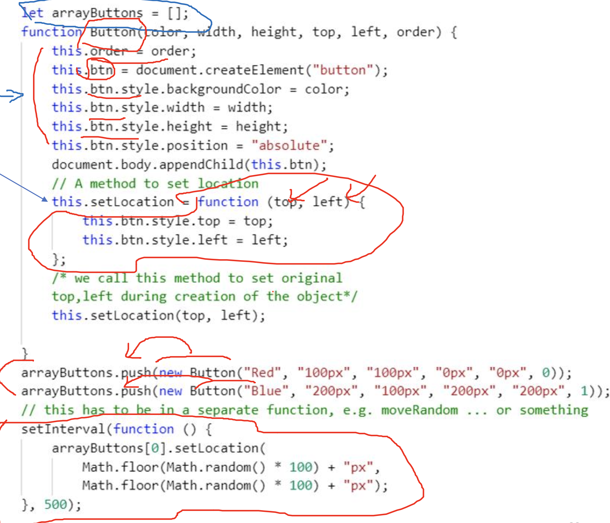

# Outline
1. What is internet software architecture all about?

2. The architecture we focus on: `API-centric`, service based

3. `JSON` as a way of data payload in API communications

# What is Internet Software / Application Architecture?
- `Architecture` refers to interaction/relation among components
    - computer architecture: interaction/relation among CPU, memory, storage, I/O
        - focus is on speed, power usage, efficiency, computational power
    - web application: interaction/relation amoung UI, Database, Logic
        - focus is on reliability, scalability, security, ease of implementation, modularity

- Architectural patterns help us better evaluate the `efficiency`, `robustness`, `security`, `performance`, `modularity`, `cost of maintenance`, `development and extension`, `cost of delopyment`
    - **Efficiency**: how well the system uses resources (e.g., CPU, memory, power) to perform tasks
        - ex: pipelining in prrocessors inscreases instruction throughput by overlapping execusion stages
        - ex: caching mechanisms reduce access times for frequently used data
        - ex: in distributed systems, using load-balancing patterns ensures efficient utilization of server resources

    - **Cost of maintenance**: the cost and effort required to keep the system operational, updated, and free of defects
        - ex: microservices architecture isolates functionalities, making it easier to update or fix specific components without disrupting the entire system
        - ex: clear separation of concerns reduces debugging complexity, lowering long-term maintenance costs

    - **Development and extension**: the ease with which the system can be developed initially and extended over time
        - ex: patterns like plugin architectures allow new functionalities to be added without altering the core system
        - ex: in software frameworks, adhering to MVC (Model-View-Controller) makes it simpler to integrate new UI features without affecting business logic

    - **Robustness**: the system's ability to handle errors, unexpected inputs, and adverse conditions gracefully
        - ex: patterns like failover architectures ensure continuity by switching to backup systems during failures
        - ex: RAID (Redundant Array of Independent Disks) enhances robustness by providing data redundancy

    - **Security**: measures taken to protect the system from unauthorized access, vulnerabilities, and attacks
        - ex: zero-trust architecture assumes no implicit trust, securing each access point rigorously

    - **Modularity**: the degree to which a system is composed of discrete, interchangeable components
        -ex: service-oriented architecture (SOA) promotes modularity by defining services as independent units of functionality
        - ex: modular hardware, such as in smartphones, allows easy component upgrades (e.g., swapping a battery or camera)

    - Cost of development: the expenses involved in designing and implementing the system
        - ex: scalable architectures optimize initial development effort by aligning with anticipated future needs
        - ex: using frameworks and libraries reduces the need for custom development, saving time and mone

# Multi-tier Architecture: Architectural Pattern
- a 3-tier architecture could be formed by `client`, `applicatino server`, `database server`
- could be 1 server, multi database server
- could be multi server, multi database server

# Linear Layerd (Multi-layered) Architecture: Architecture Pattern
- layers = functional elements
- presentation layer (UI layer): interaction with the end-usr is handled (e.g. form page)
- business layer (business logic): conrols the application's logic (e.g. decision making, routing requests)
- application layer: where the core functinos of the app is implemented (e.g. libraries)
- database layer: where access and retrival of data are handled (e.g. databases)

# Service Oriennted Architecture (Microservice): Architecture Pattern
- the components could be each providing a separate
    - all forming a collection of loosly coupled services (almos independent)
    - when a service reaches a specific level, it could be created in the form of a separate, stand alone app
    - `microservice`: split the serverices into smaller pieces so that each service executes a single functionality
    - each service can reside in a separate machine. be written in a different technology stack and can be up and running separately. 
        - ex- msg app is a service to the facebook app. when fb shuts down, msg app still works
- `SOA`: service-oriented architecture
- `MSA`: microservice architecture

- Pros
    - enable to add new components to the system and fix any bugs w/o shutting everything down
    - once service is meant to be responsible for one function: different teams to work on each service and thus speed up the development process

- Cons
    - complicated: `API` is the only way the service can communicate over

# Monolithic Architecture: Architecture Pattern
- composed all in on peice <-> microservices
- traditional unified model for the design of a software program. often entire software resides in one machine, entire software is written one backend technology stack
- entire app is usually written in one backend technology

# API-centric, Service Based Architecture
we practice a simplified version of microservice architecture (MSA)
we design **an api centric MSA**

- API: api calls follow **RESTful** architecture
- Different origin: client and servers are not hosted on the same machine (HTML files and nodejs files are not in the same machine), even services might not be hosted in the same machine
- Response: coming back from services are often in **JSON** format

# Web Storage - inside your browser
- before HTML5, app data had to be sotred in cookies
- web storage is more secure, large amount of data can be stored (5MB or up)
- **web storage is per origin**: per domain and protocol
- all pages from the same origin, can store and acces the same data within the same browser
- clinet-side storage: it resides in the local data storage of your browser

# `localStorage` vs `sessionStorage`
there are two HTML web storage objects for storing data on the client

- `window.localStorage`: no expiration date
- `window.sessionStorage`: for one session (data lost when the browser tab is closed)

check browser support before using web storage
```javascript
if (typeof(storage) !== "undefined") {
    // code for sessionStorage/ localStorage
} else {
    // web storage is not supported in this browser
}
```

# The `localStorage` Object
- no expiration date
- data will not be deleted when the browser is closed
- willbe availalbe the next day, week, or year
```javascript
// store
localStorage.setItem("myKey", "monday and friday");

// retrive
localStorage.getItem("myKey");

// name/value pairs are alwauys stored as strings
```

- This code snippet writes something onto local storage
```html
<html lang="en">
<body>
    <script>
        const msg_notSupported = "Sorry web Storage is not supported!";
        const msg_key = "hidden secret";
        const msg_written="A piece of data was written in local storage for the key:";
        if (typeof (Storage) == "undefined") {
            document.write(msg_notSupported);
            window.stop();
        }
        localStorage.setItem(msg_key, "2021");
        document.write(msg_written+msg_key);
    </script>
</body>
</html>
```

his code snippet tries to read from local storage ( remember same domain, same browser, same machine)
```html
<html lang="en">
<body>
    <script>
        const msg_notSupported = "Sorry web Storage is not supported!";
        const msg_key = "hidden secret";
        const msg_read="stored data for the key ";
        if (typeof (Storage) == "undefined") {
            document.write(msg_notSupported);
            window.stop();
        }
        document.write(msg_read+msg_key+":"+localStorage.getItem(msg_key));
    </script>
</body>
</html>
```

Q. How can I store the entire object into the local storage ?
A.

# JSON or JavaScript Object Notation
- flatten a Javascript object into a JSON string and send it to another computer over the net
```javascript
let myObj = { name: "John", age: 22, city: "Vancouver" };
let myJSON = JSON.stringify(myObj);
console.log(myJSON + " another string"); // { name: "John", age: 22, city: "Vancouver" }
console.log(myObj + " another string"); //[object Object]

// Q: What is the type of myJSON here?
// A:
```

- at the other end the json string can be parsed back to an object
```javascript
let myJSON = '{"name":"John", "age":31, "city":"New York"}';
let myObj = JSON.parse(myJSON);
console.log(myObj);// {}.... age: ,city: ,name:
```

# Passing Parameters to Event Handlers
- using same event handelr for multiple buttons (based on javascript closure)
- `closure`: a function reuturn a function
```html
<input type="button" value="hi1" id="button1">
<input type="button" value="hi2" id="button2">
<script>
    function handler(a) {
        return function () {
            console.log("Hi " + a);
        }
    }
    document.getElementById("button1").onclick = handler(1);
    document.getElementById("button2").onclick = handler(2);
</script>
```

# Object Constructor with Methods
