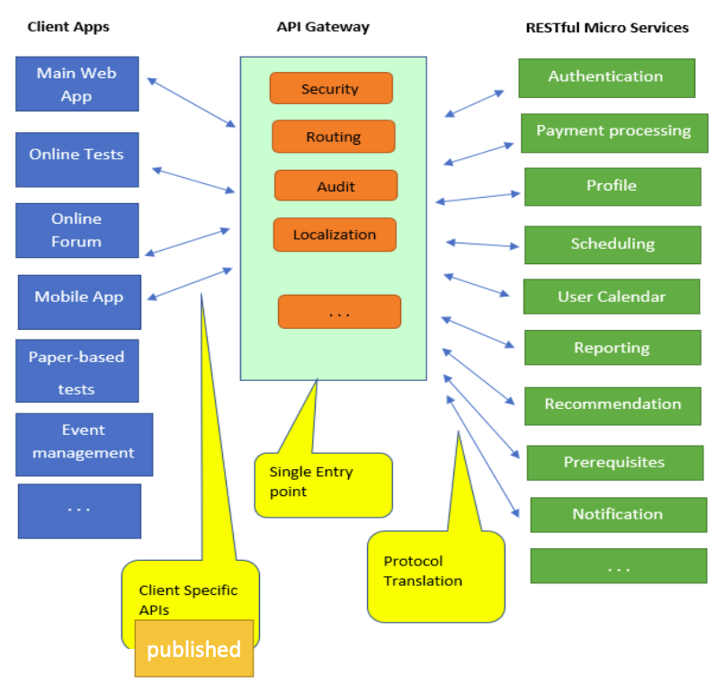

# Outline
- Why we need Web APIs
- Anatomy of Web APIs
- Postman
- Intro to RESTful architecture style
    - 5 key principles of restful service-enabled applications
    - microservices

# Review
- JavaScript Variable Hoisting (only for variables declared by `var`)

# Why We Need API Servers
- `API`: Application Programing Interface

- A user interface to access partners' data and services
- In web dev, Web API often refers to the way by which we retrieve information from an online service
- API documnetation:
    - list of URLs, query parameters etc on how to make a request from the web API server
    - Inform us what sort of response will be receive for each query (json,text file, xml etc..)

# Anatomy of Web APIs
1. Headers
    - the additional details provided for communication between client and server. Some of common headers:
        - Request: 
            - API-key: the subscription key the client. This way the server knows who is making the request
            - count: the number of objects you want
            - pageNo: page num
        - Response:
            - status: the status of request of HTTP code
            - content-type: type of resource sent by server (e.g. html/img...)

2. Data(aka body or message)
    - contains info you want to send to the server

3. Endpoint
    - URL wehre the API server is listening to

4. HTTP Methods 
    - determinds method of communication between client and server
    - Web API servers implements multiple methods for different types of request
        - `GET`
        - `POST`
        - `PUT`: update
        - `DELETE`: 

# `GET` vs `POST` method
- `GET`
    - is used to request data from a specified resource
    - the query string(name, value pairs) is sent in the URL of a GET request
    - /test/demo?name1=value1&name2=value2
    - GET requests
        - can be **cached**
            - re-execcuted but may not be re-submitted to server if the HTML response is already stored in the browser cache
        - **remian in the browser history** - no bueno for sensitive data
        - can be **bookmarked**
        - **length restrictions** on data size
        - should be used to **REQUEST** data only

- `POST`
    - is used to send data to a server to create/update a resource
    - the data sent to the server with POST is stored in the request body of the HTTP request (not part of the URL)
    - POST requests
        - are **never cached**
        - **cannot be bookmarked**
        - **do not remain in browser history**
        - no restrictions on data length
        - if refreshing leads to resending a post request (using from), the browser warns the user

# How to Test and Try an API
- use postman

# What's RESTful API
- it's service follows RESTful Architeectural style
    - **REST**: Representational State Transfer Architectural Design
    - stateless model helps applications to scale easily
    - separates data preparation and data connsumption

- Microservices
    - as a way of implementing the backend of RESTful API servers
    - aiming to reduce the complexity in designing by improving modularity
    - systems by splitting the core components into small and independent pieces -> **do a single task**
    - allows developers to not only enhance productivity but also speed up the entire deployment process
    - The components making up an application build using the Microservices Architecture aren’t directly dependent on each other. As such, they don’t necessitate to be built using the same programming language
    - **simpler and quicker**

- Relation between Microservices and RESTful API
    - the microservices communicate via RESTful API calls

# Micro-service Architecture Diagram

- Services communicate via API calls
- Every request goest through API gateway
- Gateway is reponsible for routing, authentication, auditing...
- client specific APIs are the one published to developers
- Each mocroservice could be devloped in a different technology stack and could be hosted in a server geographically separated from other services

# RESTful Architecture Key Principals
1. Everything (to expose) is a resource
    - The actual data or information that the API exposes. 
    - It could be a user, a product, a document, or any other entity.

2. Each resource is identifiable by a URI (Uniform Resource Identifiers)
    • A URI can be made up of several components, including the host name or IP address, port number, the path, and an optional query string

3. Resources can be represented in various formats ( JSON, HTML, XML …)

4. Resources are manipulated via standard HTTP methods

5. Communicate with resources in a stateless manner

6. Cacheability: Responses from the server can be explicitly marked as cacheable or non-cacheable, allowing
clients to cache responses and improve performance.

7. Layered System: A client can interact with the server, and vice versa, through an intermediary layer (like a
proxy or load balancer). This layered architecture enhances flexibility, scalability, security and decoupling the
architecture.

# For What We Are Using API RESTFul server
• Visibility
• Reliability
• Scalability
• Performance
