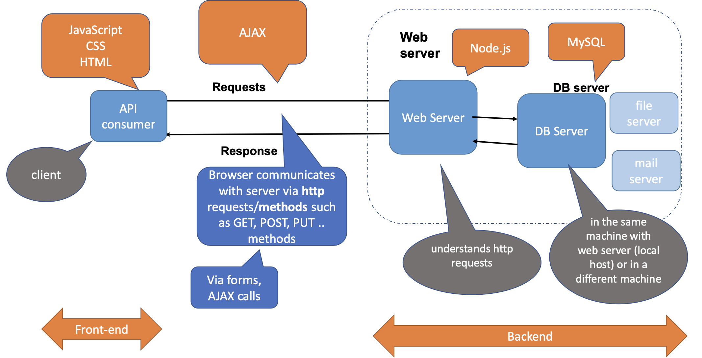

# Server and Server Scripting
### What is a server?
- a computer(s) running 24/7 and accessible via the internet
- when a client (such as browser or mobile app) sends a requests via protocol (such as http, ftp, etc), the server looks for the application reponsible to deal with the request, and returns the response using those protocols
- in this course, the request from the client to server are carried using **http** methods
    - GET, POST...



### What a Server Side Scripting Language Can Do?
- It can create a webserver to generate dynamic page content
    - e.g. opening wordpress.com/index.php at browser
        - sends a request to the server
        - the server looks for an app to run php files
        - if the php server is installed, it runs that file and returns the result in the form of html
- Server side script can create, open, read, write, delete, and close **files** on the server
- Server side script can collect from data
- Server side script can add, delete, modify data in your **database**

# `Node.js` for Server Side Scripting
- `Node.js` is an open source, free, cross-platform server environment that uses **JavaScript** on the server side
    - Chrome V8 engine
    - executes JavaScript code **outside a web browser**

### Why `Node.js`
- How PHP/ASP handles a file reqeust:
    - send the task to the computer's file system
    - waits while the file system opens and reads the file
    - returns the content to the client
    - ready to handle the next request

- How `Node.js` handles a file reqeust: **Non blocking**
    - sends the task to the computer's file system
    - ready to handle the next request
    - when the file system has opened and read the file, the server returns the content to the client

- `Node.js` eliminates the waiting, and simply continutes with the next request
- **Memory efficient**: runs single-threaded, non-blocking, asynchronously programming

# `JS is Asynchronous Single Threaded Nonblocking
- Restaurant Analogy
- **Asynchronous**: Pre-made food truck style
    - one server can server multiple tables
    - `JavaScript`(Node.js): ***non-blocking***
        - `JavaScript` is a **single threaded asynchronous architecture**

- **Synchronous**: Fatburger style
    - one server can server multiple tables
    - wait for a beginner cook who can handle only one meal at a time to make one meal 
    - issue: we are not utilizing our resources (server) efficiently
        - multiple reqeusts -> the system has to create multiple threads (multiple staff)

- **Multi-threaded**: Fancier Cactus style
    - multiple servers
    - each server dedicated to server a single table only

# Functions in Modules
### Modules in `Node.js`
- Modules are quite similar as JavaScript libraries
    - A set of functions you want to include in your application

```JavaScript
const module = require('./modules.math');
```

### Ex - A Simple Http Server
- built in module `http`
- the server receives a request from the client

```JavaScript
const http = require('http');

http.createServer(function (req, res) {
    console.log('The server received a request');
    res.writeHead(200, {'Content-Type': 'text/html', 'Access-Control-Allow-Origin': "*"}); 
    // If a web page from another domain tries to fetch data from this server, the browser will allow it
    res.end('Hello <b> World');
}).listen(8000);

console.log('Server is runing and listening...');

// The Access-Control-Allow-Origin header is used in HTTP responses to control which origins (websites) are allowed to access resources from a server in a cross-origin request.
```

### Ex- Returning Server's Current Date
```JavaScript
//myModule.js
exports.area = function() { return Date(); };
```
```JavaScript
let http = require('http');
let dt = require('./myModule');

http.createServer(function(req, res) {
    res.writeHead(200, {'Content-Type': 'text/html'});
    res.write("Now: " + dt.myDateTime());
    res.end();
}).listen(8000);
```

### Ex- Using Url Built-In Module to Pars Parameters in a String
```JavaScript
let url = require('url');
let adr = 'http://localhost:0101/default.htm?name=John&age=23';
let q = url.parse(adr, true);
console.log(q.host); //returns 'localhost:0101'
console.log(q.pathname); //returns '/default.htm'
console.log(q.search); //returns '?name=John&age=23'
let qdata = q.query; //returns an object: { name: John, age: 23 }
console.log(qdata.name); //returns 'John'
```

### Ex- Http Server with Parameters
```JavaScript
let http = require('http');
let url = require('url');

http.createServer(function(req, res) {
    let q = url.parse(req.url, true);
    console.log(q.query); // ?name=john
    res.writeHead(200, {'Content-Type': 'text/html'});
    res.write("Hello " + q.query["name"]);
}).listen(8000);
```

### Ex- `fs` the File System Built-In
- Allows us to work with the file system on our computer or server
```JavaScript
const http = require('http');
const url = require('url');
const fs = require('fs');

http.createServer(function (req, res) {
    const q = url.parse(req.url, true);
    const filename = "." + q.pathname;
    fs.readFile(filename, function (err, data) {
        if (err) {
            res.writeHead(404, { 'Content-Type' : 'text/html'});
            return res.end(q.pathname + " 404 Not Found ");
        }
        res.writeHead(202, { 'Content-Type' : 'text/html' });
        res.write(data);
        return res.end();
    });
}).listen(8000);
```

- `4xx` status: client error
    = authentication failes or 
    = client asked for a file which did not exist

# Others
- phpMyAdmin (free and open source relational db admin tool for this class)